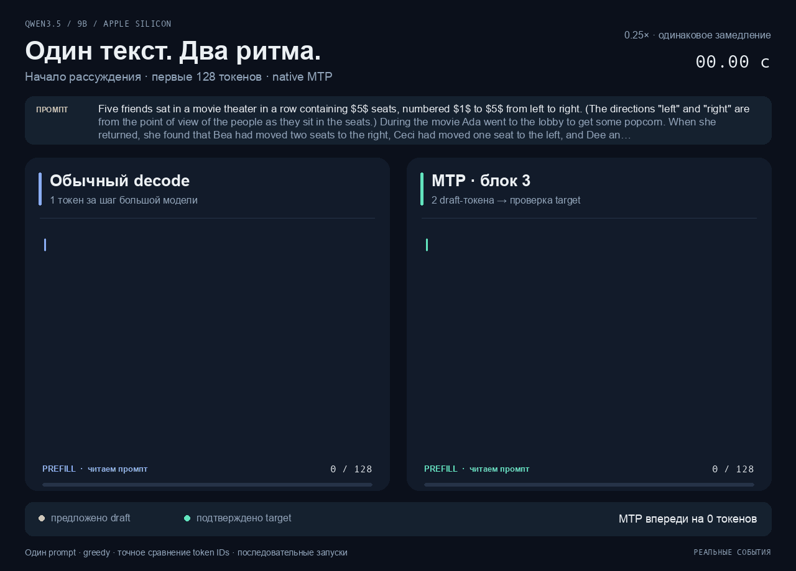
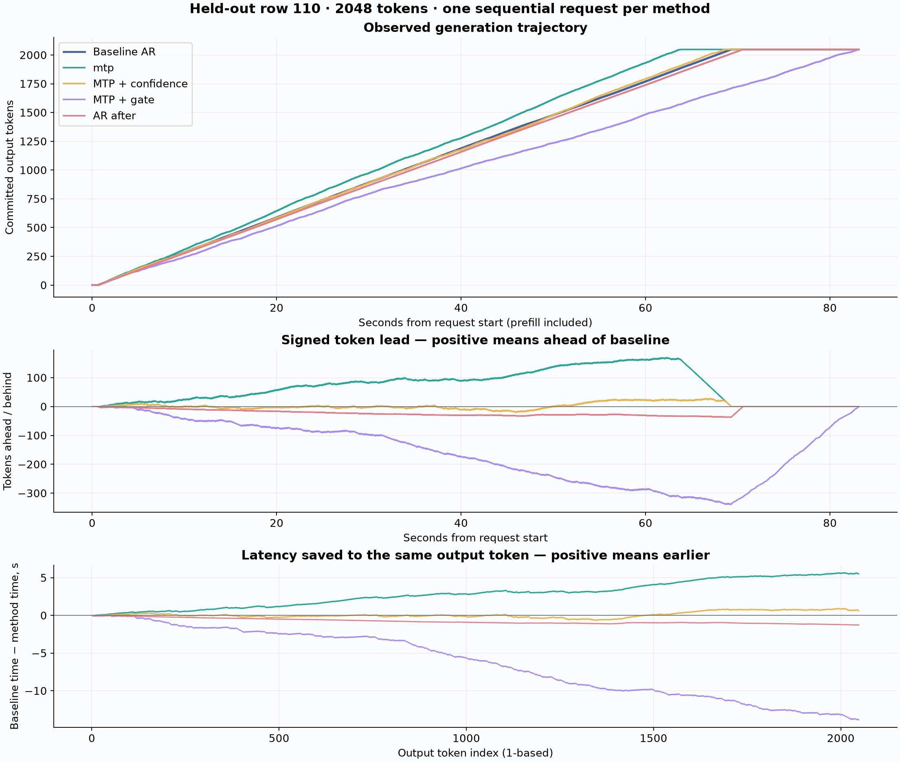

<div align="center">

# Inference Acceleration

### Same tokens. Sooner.

Qwen3.5 · 9B · 4-bit · Apple Silicon · Native MTP

**Five-prompt pilot:** **34.81 → 41.58 tok/s** decode on an M2 Pro · **2,560 / 2,560** output token IDs matched



[Watch at original speed](docs/assets/mtp-real-time.gif) · [Measurements](docs/results/mtp-512.md) · [Русское руководство](docs/guide.ru.md)

</div>

A reproducible inference lab for the text component of [Qwen3.5-9B-4bit](https://huggingface.co/mlx-community/Qwen3.5-9B-4bit). Compare Transformers, vLLM Metal, MLX-LM and MLX-VLM on the same prompts, then measure native MTP and DFlash speculative decoding. Every executable task has a shell launcher and a matching Python entry point.

## What you are watching

The animation replays **real recorded events** from one selected math prompt. Blue is ordinary generation; gold tokens are MTP proposals; green tokens have passed target verification. Both lanes use the same clock scale and are slowed down **4×** so the draft-and-check steps are visible. The runs were recorded sequentially on the same GPU, then aligned at request start.

| Selected demo · first 128 reasoning tokens | Ordinary decode | Native MTP |
|---|---:|---:|
| Time to the last displayed token, including prefill | 4.169 s | **3.914 s** |
| Output token IDs | 128 | **128, exactly matching** |

MTP finishes this fragment **0.256 s earlier**: a **1.065×** ratio of completion times. This is a selected illustration, not an estimate of the dataset-wide speedup. Other trial prompts did not show a speedup; [the demo notes](docs/generation-demo.md) disclose those trials and explain the timing instrumentation. The displayed text is a reasoning fragment, not a complete solution.

Inspect the [prompt](configs/demos/seating-puzzle.txt), [event trace](docs/examples/mtp-trace.json) and [trace provenance](docs/examples/mtp-trace.provenance.json).

## Measured acceleration

**Apple M2 Pro · 19 GPU cores · 16 GB unified memory · macOS 15.6.1**
Five prompts × 512 generated tokens; greedy, batch size 1; identical target weights and input token IDs. Values are arithmetic means ± sample standard deviations across prompts, in tokens/second.

| Runtime | Prefill, tok/s | Decode, tok/s |
|---|---:|---:|
| MLX-VLM baseline, before MTP | 178.61 ± 29.77 | 34.81 ± 0.47 |
| **Native MTP · block 3** | **181.64 ± 31.79** | **41.58 ± 0.96** |
| MLX-VLM baseline, after MTP | 151.10 ± 25.33 | 30.30 ± 4.39 |

**+19.4% decode throughput** relative to the faster, preceding baseline. All **2,560 output token IDs match** both baselines. MTP accepted **1,606 / 1,899 draft tokens (84.57%)**. Peak MLX allocated memory was **5.48 GB → 5.62 GB**.

The later baseline slowed down, so the larger ratio against it is not our headline. These runs used battery power, temporary `caffeinate -di` assertions and wired memory; temperature and clock frequencies were not controlled. SD describes variation between five prompts, not a confidence interval. The native MTP path also uses fused quantized argmax, so this measures the complete runtime path rather than isolating the contribution of speculation alone. See [per-prompt results and provenance](docs/results/mtp-512.md).

The [100-prompt framework comparison and five-prompt recheck](docs/results/frameworks.md) cover Transformers/MPS, official vLLM Metal, MLX-LM and MLX-VLM. [Short speculative experiments](docs/results/speculative-128.md) include MTP blocks 2/3 and DFlash blocks 2/3/5 with 4/8-bit drafts.

The **100-prompt × 2048-token comparison is not complete**. Its first attempt was interrupted after confirmed Mac lid sleep and a power-source change; none of those partial results is used for the acceleration claim above. A guarded repeat is prepared and currently deferred. Per-request token/event logging and offline replay are implemented; see the [long-run protocol and interruption record](docs/benchmark-methodology.md#полная-парная-серия-100--2048).

## Long trajectories and confidence gating

The [2026 research survey](docs/inference-acceleration-survey-2026.md) compares 18 directions, including DFlash, diffusion drafting, adaptive speculation, kernels and KV-cache methods, with primary sources and explicit Apple Silicon constraints.

A separate [10-chain calibration + 1 held-out experiment](docs/mtp-confidence-experiment.md) tests a threshold on the product of two native-MTP token probabilities. It records every proposal, acceptance decision and commit timestamp, then plots signed token lead over ordinary decode. Threshold selection, confidence-readout overhead and the final held-out timing are evaluated separately.

On the held-out **2048-token** chain, all five outputs matched exactly:

| Runtime | Decode, tok/s | Total generation, s |
|---|---:|---:|
| AR before | 29.83 | 69.264 |
| **Stock MTP** | **32.44** | **63.769** |
| MTP + probability collection | 30.11 | 68.662 |
| MTP + confidence gate, threshold 0.65 | 24.83 | 83.130 |
| AR after | 29.29 | 70.537 |

Stock MTP improved decode by **8.75%** against the first baseline. The gate **slowed it by 16.77%**, despite increasing acceptance among verified draft tokens to 97.40%: it pays draft/confidence costs before deciding to skip verification. This is one held-out trajectory, not a dataset-wide speed estimate. [Full protocol, threshold validation and rejection examples](docs/mtp-confidence-experiment.md).



### Beyond MTP: next local experiments

The [September 22 research roadmap](docs/beyond-mtp-local-roadmap-2026-09-22.md) prioritizes suffix/ngram drafting, DFlash 2 style candidate selection, tree verification, EAGLE3 and semantic step verification. It distinguishes exact token acceleration from MCTS or best-of-N reasoning, and proposes small experiments for this 16 GB Mac. These alternatives are research proposals, not new benchmark results.

### Inspect what the MTP head gets right and wrong

Browse [60 annotated examples](docs/examples/mtp-examples.md), grouped by formatting, numbers, formulas, wording and token boundaries. The [offline interactive catalog](docs/examples/mtp-examples.html) contains **all 8,409 verified pairs**, with context, actual target continuation, confidence, token IDs and filters. Open the HTML locally; GitHub displays its source. [How to use and rebuild it](docs/mtp-examples-guide.md).

## How MTP works here

The draft is a separate, pretrained [Qwen3.5 MTP head](https://huggingface.co/mlx-community/Qwen3.5-9B-MTP-4bit), approximately **137 MB** in 4-bit form. It reuses the target model's embedding and output head. This project does not train new weights.

With **block size 3**, the head proposes up to **two future tokens** in succession. The target verifies an anchor plus those proposals along the sequence dimension of **one request**. Accepted tokens are committed together; a rejected suffix is discarded and the target supplies the correction. Fewer full target passes are needed per emitted token when acceptance is high. The GIF displays each proposal packet together, then highlights its verification result.

Correctness here means exact greedy token-ID agreement on the measured inputs. Speedup depends on acceptance, draft overhead, output length and runtime kernels; it is not guaranteed for every prompt. [Implementation and research notes](docs/speculative-decoding-research.md).

## Run it on your Mac

Requires Apple Silicon, macOS 15+, an available `python3` for bootstrap, and [uv](https://docs.astral.sh/uv/getting-started/installation/). The measured machine has 16 GB of unified memory. Setup uses project-local environments and pinned dependencies; weights and datasets download separately.

```bash
git clone https://github.com/ThunderstormXX/inference-acceleration.git
cd inference-acceleration

# Main MLX environment and pinned downloads
bash scripts/setup/environment.sh
bash scripts/download/model.sh
bash scripts/download/dataset.sh     # exactly 100 rows
bash scripts/download/mtp.sh         # the separate MTP head

# Full matched series: 100 prompts × 2048 tokens per runtime, with event logs
bash scripts/benchmark/mtp_series.sh \
  --count 100 --max-new-tokens 2048 --chunk-size 5 \
  --label mtp-long2048-awake
```

The series alternates baseline→MTP and MTP→baseline in five-prompt blocks, with a fresh process and one unmeasured warmup for every block. It saves its progress in `artifacts/series/mtp-long2048-awake/manifest.json`; add `--resume` to the same command after an interruption. Completed blocks are checked and reused. Keep the lid open and connect adequate external power: each process requires AC without battery discharge at its endpoints, and more than one second of detected system sleep invalidates that block. Each request saves its complete output and actual event timestamps, including draft proposals and verification. The 2048-token budget ignores EOS; it does not imply a complete solution.

For a shorter experiment, run the two roles separately:

```bash
bash scripts/benchmark/mtp.sh --mode baseline --count 5 --max-new-tokens 512 --trace-generation
bash scripts/benchmark/mtp.sh --mode mtp --count 5 --max-new-tokens 512 --trace-generation

bash scripts/report/speculative.sh \
  --baseline artifacts/runs/<baseline-run> \
  --speculative artifacts/runs/<mtp-run> \
  --output artifacts/reports/mtp
```

### Recreate the animation

Select any original dataset index **0–99** after the full series finishes. This reads the saved trajectory and loads only the local tokenizer; no model inference is repeated:

```bash
bash scripts/demo/from_logs.sh \
  --series artifacts/series/mtp-long2048-awake --index 42 \
  --output artifacts/demos/sample-042
```

Long text scrolls automatically. Add `--max-visible-tokens 128` for a short prefix, `--rates 0.25` to slow both lanes equally, or `--trace-only` to export the enriched events for your own renderer. Each GIF retains actual timings; differing outputs are shown with an explicit mismatch banner.

Render the published event trace without loading the model:

```bash
bash scripts/demo/render.sh \
  --trace docs/examples/mtp-trace.json \
  --output artifacts/demos/mtp-race
```

Or record your own actual generation first:

```bash
bash scripts/demo/trace.sh \
  --prompt-file configs/demos/seating-puzzle.txt \
  --enable-thinking --max-new-tokens 128 \
  --output artifacts/demos/mtp-race/trace.json

bash scripts/demo/render.sh \
  --trace artifacts/demos/mtp-race/trace.json \
  --output artifacts/demos/mtp-race
```

The trace renderer requires exact output token-ID agreement by default (`--allow-mismatch` explicitly shows differing trajectories). Both entry points preserve relative timing, draft rejections and corrections, and stop the displayed text before its first EOS. Full raw logs remain intact. See [recording details](docs/generation-demo.md).

### Try the other runtimes

| Task | Setup | Run |
|---|---|---|
| MLX-LM | Main environment above | `bash scripts/benchmark/mlx.sh` |
| MLX-VLM | Main environment above | `bash scripts/benchmark/mlx_vlm.sh` |
| Transformers / PyTorch MPS | `bash scripts/setup/transformers.sh` | `bash scripts/benchmark/transformers.sh` |
| Official vLLM + vllm-metal | `bash scripts/setup/environment.sh --backend vllm` | `bash scripts/benchmark/vllm.sh` |
| Official DFlash / MLX | `bash scripts/setup/speculative.sh` and `bash scripts/download/draft.sh` | `bash scripts/benchmark/speculative.sh --block-size 3 --draft-bits 4` |

Transformers uses this project's adapter for the original MLX quantized weights and macOS-compatible Metal kernels. vLLM uses the official Metal plugin. These details matter when interpreting the numbers: [framework notes](docs/framework-research.md), [measurement protocol](docs/benchmark-methodology.md).

## Project layout

```text
src/inference_lab/
  core/                         Configuration, environment and I/O
  models/                       Target, DFlash and native MTP downloads
  data/                         Dataset slice and shared tokenized prompts
  environments/                 Isolated runtime setup
  backends/apple/
    transformers/               MPS adapter and Metal kernels
    speculative/                DFlash and native MTP backends
  benchmarking/                 Runners, phase metrics, validation, reports
  visualization/                Event recording and GIF rendering
scripts/
  setup/ download/ benchmark/ report/ demo/   Paired .sh + .py tasks
configs/                        Protocol defaults and demo prompt
tests/                          Protocol, backend and renderer tests
docs/
  assets/                       Published GIFs
  examples/                     Portable event trace and provenance
  results/                      Curated measurements and source hashes
```

Models, downloaded data, virtual environments, caches and raw machine-specific artifacts stay local and are excluded from Git. Published measurements retain their provenance; cleaned copies have their own hashes. Dependencies and model/data sources are listed in [third-party notes](docs/third-party.md). The [Russian lab guide](docs/guide.ru.md) documents the full workflow and diagnostic commands.
