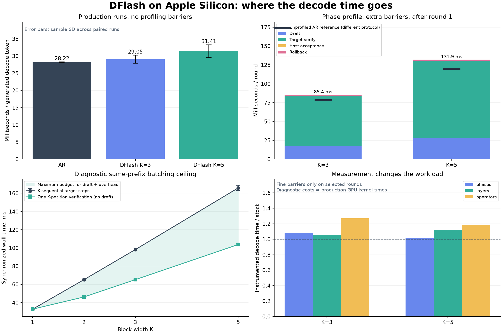

# Куда уходит время DFlash на Apple Silicon

Короткий контролируемый профиль Qwen3.5-9B-4bit и 4-bit DFlash. Реальная скорость взята из прогонов без профилировщика; этапы, слои и операторы измерены отдельными прогонами.

Устройство: **Apple M2 Pro**. 3 промпта, 128 сгенерированных токенов на прогон, 2 повтора основной пары AR/DFlash. Первый токен относится к prefill; decode содержит 127 токенов. Детальные раунды: 1, 10, 20.

Все token IDs совпали с AR во всех 31 прогонах: **да**. EOS игнорируется, sampling greedy, кэш свежий на каждый запрос. Время декодирования текста в измерения не входит.



## Проверка гипотезы о быстрой верификации

Ускорение получается, если `T_draft + T_verify + T_rollback + T_host < (accepted + 1) × T_AR`. Здесь `K` — длина проверяемого блока: один уже известный токен и до `K−1` предложений draft. Это позиции одной последовательности при batch size 1, а не K независимых запросов. При отказе оплачивается проверка всего блока, а полезен только принятый префикс и исправляющий токен target.

## Скорость без инструментирования

Основная таблица исключает заключительную контрольную пару. ± — выборочное стандартное отклонение между прогонами, а не доверительный интервал; повторения одного промпта не являются новыми независимыми задачами.

| Режим | n | tok/s | мс / токен | Принято draft | Полезных / раунд |
| --- | --- | --- | --- | --- | --- |
| AR | 6 | 35.43 ± 0.08 | 28.22 ± 0.07 | — | — |
| DFlash K=3 | 6 | 34.47 ± 1.39 | 29.05 ± 1.15 | 87.8% | 2.74 |
| DFlash K=5 | 6 | 31.93 ± 1.82 | 31.41 ± 1.86 | 80.4% | 4.14 |

Парное ускорение — отношение времени AR к DFlash на том же промпте в том же повторе; >1 означает ускорение.

| Промпт (индекс) | K | AR / DFlash, среднее ± SD |
| --- | --- | --- |
| 0 | 3 | 1.023 ± 0.004 |
| 0 | 5 | 0.941 ± 0.006 |
| 1 | 3 | 0.959 ± 0.012 |
| 1 | 5 | 0.928 ± 0.006 |
| 2 | 3 | 0.937 ± 0.000 |
| 2 | 5 | 0.835 ± 0.011 |

## Этапы одного раунда

Только режим `phases`: границы принудительно материализуют lazy MLX-граф и синхронизируют поток. Это диагностическая декомпозиция с дополнительными барьерами. Первый draft отдельно проецирует признаки всего промпта и наполняет свой KV-кэш; эту разовую работу исходный генератор выполняет уже после первого target-токена, внутри decode.

Сравнение без профилировщика: суммарное decode-время делится на суммарное число раундов, а полезные токены — на то же число раундов. Это объясняет реальную разницу без смешивания с синхронизированным профилем:

| K | Stock DFlash, мс / раунд | Полезных / раунд | AR для того же числа токенов, мс |
| --- | --- | --- | --- |
| 3 | 79.62 | 2.74 | 77.36 |
| 5 | 130.07 | 4.14 | 116.89 |

Чёрная отметка AR на графике фаз — ориентир из другого протокола. Разницу с инструментированным столбцом нельзя выдавать за точный прогноз production-ускорения.

| K | Раунд | Draft, мс | Verify, мс | Host, мс | Rollback, мс | Сумма средних, мс |
| --- | --- | --- | --- | --- | --- | --- |
| 3 | Первый | 27.31 ± 7.12 | 63.82 ± 0.52 | 0.49 ± 0.02 | 2.78 ± 0.67 | 94.41 |
| 3 | После первого | 17.58 ± 0.61 | 66.09 ± 1.44 | 0.64 ± 0.18 | 1.11 ± 1.44 | 85.43 |
| 5 | Первый | 37.62 ± 6.55 | 102.54 ± 0.08 | 0.43 ± 0.06 | 2.39 ± 0.11 | 142.98 |
| 5 | После первого | 27.89 ± 2.28 | 102.30 ± 7.78 | 0.51 ± 0.13 | 1.23 ± 1.33 | 131.93 |

Средние по раундам, поэтому промпты с большим числом раундов получают больший вес. Последний неполный блок также включён. Остаток между decode wall time и суммой корневых этапов — управление генератором и профилировщиком вне границ, а не спрятанный GPU-оператор.

| K | Rollback все раунды, мс | Только при trim>0, мс | Доля trim>0 | Остаток / прогон, мс |
| --- | --- | --- | --- | --- |
| 3 | 1.15 ± 1.45 | 4.16 ± 1.27 | 16.5% | 11.02 ± 2.35 |
| 5 | 1.27 ± 1.33 | 2.90 ± 0.82 | 35.9% | 5.43 ± 1.75 |

Rollback повторяет только recurrent `gated_delta_update` для принятого префикса в 24 GDN-слоях и обрезает attention-кэши. Он не запускает заново полные target-слои с MLP. Даже при trim=0 остаётся цена границы профиля и проверки состояния.

## Сколько даёт сама проверка блока

Один фиксированный префикс длиной 165 токенов; 5 парных повторов для каждой ширины. Обе ветки получают одни и те же следующие токены реальной AR-траектории. Кэш клонируется до таймера; его исходный снимок проверяется на неизменность. Block включает production GDN capture, hidden concat и host transfer. Sequential выполняет K законченных однотокенных шагов с обычным GDN; feature hooks остаются, concat не выполняется.

| K | K последовательных, мс | Проверка блока, мс | Отношение seq / block | Идеальный остаток для draft + остального, мс | Argmax совпал | Δ cache max |
| --- | --- | --- | --- | --- | --- | --- |
| 1 | 32.70 ± 0.73 | 32.75 ± 1.14 | 0.999 | -0.05 | да | 0.000000 |
| 2 | 65.14 ± 0.97 | 46.15 ± 0.30 | 1.412 | 18.99 | да | 0.000000 |
| 3 | 98.22 ± 1.70 | 65.18 ± 0.51 | 1.507 | 33.04 | да | 0.000000 |
| 5 | 165.89 ± 2.82 | 103.73 ± 1.03 | 1.599 | 62.15 | да | 0.000000 |

Конечные кэши сравнены отдельно с абсолютным допуском 0.001; все в допуске: **да**. Равенство argmax не означает побитового равенства внутренних recurrent состояний.

Sequential в этом probe завершает и материализует каждый шаг, включая кэш; production AR использует другой граф выполнения и pipeline. Поэтому его цена одного токена может отличаться от основной AR-таблицы. Нельзя подставлять этот sequential вместо production AR при предсказании end-to-end ускорения. Это верхняя оценка выгоды batching на известном продолжении: здесь нет draft, отказов и rollback. Разность `K sequential − block` — бюджет только при принятии всего блока. Реальный бюджет меньше и зависит от числа полезных токенов. Нельзя выдавать это отношение за итоговое ускорение DFlash.

## Где находятся дорогие слои

Следующая таблица использует отдельный режим `layers`, только детальные раунды после первого. Режимы `layers` и `operators` в этом протоколе измеряют промпт с индексом 0; phase-профиль охватывает все промпты. У каждого decoder layer материализуется выход; `fc` и vocabulary head измеряются отдельно. Некоторые lazy-побочные записи кэша, например contiguous-копия convolution state GDN, могут завершиться лишь в общей границе фазы: там отдельно материализуются все кэши. Полное время фазы их включает, но таблица слоёв не распределяет каждую cache-write операцию по её источнику. Inclusive-время слоя включает его внутренние операции. Эти числа нельзя складывать с вложенными operator-временами из следующего раздела.

| Слой / модуль | K=3, мс ± SD | K=5, мс ± SD |
| --- | --- | --- |
| `draft.fc` | 1.21 ± 0.02 | 2.52 ± 0.27 |
| `draft.lm_head` | 5.09 ± 0.04 | 10.64 ± 0.10 |
| `draft.layers.0` | 2.15 ± 0.04 | 5.03 ± 0.91 |
| `draft.layers.1` | 2.10 ± 0.03 | 4.28 ± 0.10 |
| `draft.layers.2` | 2.26 ± 0.05 | 4.46 ± 0.28 |
| `draft.layers.3` | 2.10 ± 0.02 | 4.36 ± 0.12 |
| `draft.layers.4` | 2.26 ± 0.37 | 4.47 ± 0.27 |
| `draft.layers.5` | 2.05 ± 0.00 | 4.91 ± 0.58 |
| `target.language_model.lm_head` | 7.57 ± 0.03 | 12.76 ± 0.06 |
| `target.layers.0` | 2.26 ± 0.02 | 4.62 ± 0.29 |
| `target.layers.1` | 2.20 ± 0.10 | 4.36 ± 0.12 |
| `target.layers.2` | 2.14 ± 0.05 | 4.47 ± 0.16 |
| `target.layers.3` | 2.28 ± 0.12 | 4.13 ± 0.03 |
| `target.layers.4` | 2.25 ± 0.05 | 4.08 ± 0.39 |
| `target.layers.5` | 2.18 ± 0.08 | 4.42 ± 0.06 |
| `target.layers.6` | 2.16 ± 0.13 | 4.53 ± 0.36 |
| `target.layers.7` | 2.11 ± 0.06 | 4.32 ± 0.13 |
| `target.layers.8` | 2.25 ± 0.06 | 4.47 ± 0.08 |
| `target.layers.9` | 2.18 ± 0.10 | 4.34 ± 0.17 |
| `target.layers.10` | 2.18 ± 0.00 | 3.87 ± 0.03 |
| `target.layers.11` | 2.24 ± 0.26 | 4.34 ± 0.08 |
| `target.layers.12` | 2.18 ± 0.06 | 4.98 ± 0.81 |
| `target.layers.13` | 2.18 ± 0.11 | 4.23 ± 0.15 |
| `target.layers.14` | 2.28 ± 0.08 | 4.60 ± 0.09 |
| `target.layers.15` | 2.15 ± 0.00 | 4.67 ± 0.13 |
| `target.layers.16` | 2.16 ± 0.03 | 4.37 ± 0.13 |
| `target.layers.17` | 2.19 ± 0.15 | 4.08 ± 0.26 |
| `target.layers.18` | 2.26 ± 0.12 | 4.49 ± 0.28 |
| `target.layers.19` | 2.15 ± 0.10 | 3.74 ± 0.06 |
| `target.layers.20` | 2.18 ± 0.02 | 4.56 ± 0.30 |
| `target.layers.21` | 2.21 ± 0.03 | 4.54 ± 0.09 |
| `target.layers.22` | 2.19 ± 0.04 | 4.12 ± 0.26 |
| `target.layers.23` | 2.08 ± 0.00 | 4.37 ± 0.06 |
| `target.layers.24` | 2.14 ± 0.07 | 4.48 ± 0.27 |
| `target.layers.25` | 2.11 ± 0.04 | 4.49 ± 0.04 |
| `target.layers.26` | 2.24 ± 0.16 | 4.08 ± 0.17 |
| `target.layers.27` | 2.05 ± 0.01 | 4.51 ± 0.21 |
| `target.layers.28` | 2.13 ± 0.04 | 4.85 ± 0.14 |
| `target.layers.29` | 2.12 ± 0.03 | 4.48 ± 0.73 |
| `target.layers.30` | 2.16 ± 0.07 | 4.96 ± 0.71 |
| `target.layers.31` | 2.03 ± 0.06 | 4.16 ± 0.01 |

## Операторы и формы тензоров

Режим `operators` материализует входы до каждой измеряемой операции, затем выход и синхронизирует поток. В таблице приведены только QuantizedLinear и отдельно обёрнутые attention/GDN-операции: их inclusive-времена не вложены друг в друга. «Сумма / раунд» складывает одинаковые операции по всем слоям внутри измеренных раундов; это стоимость в сильно инструментированном исполнении, **не процент времени stock**. SD относится к доступным детальным раундам, которых мало.

### K=3: измеренные операции после первого раунда

| Группа | Вызовов | Один вызов, мс ± SD | Сумма / раунд, мс ± SD | Пример входа → выхода | Логическая W |
| --- | --- | --- | --- | --- | --- |
| `target.MLP.up_proj` | 64 | 0.647 ± 0.133 | 20.71 ± 0.40 | `[1,3,4096] bfloat16 → [1,3,12288] bfloat16` | [12288, 4096] |
| `target.MLP.gate_proj` | 64 | 0.638 ± 0.132 | 20.40 ± 0.85 | `[1,3,4096] bfloat16 → [1,3,12288] bfloat16` | [12288, 4096] |
| `target.MLP.down_proj` | 64 | 0.608 ± 0.080 | 19.47 ± 0.87 | `[1,3,12288] bfloat16 → [1,3,4096] bfloat16` | [4096, 12288] |
| `target.in_proj_qkv` | 48 | 0.522 ± 0.157 | 12.54 ± 1.11 | `[1,3,4096] bfloat16 → [1,3,8192] bfloat16` | [8192, 4096] |
| `target.out_proj` | 48 | 0.404 ± 0.237 | 9.71 ± 1.77 | `[1,3,4096] bfloat16 → [1,3,4096] bfloat16` | [4096, 4096] |
| `target.in_proj_z` | 48 | 0.380 ± 0.099 | 9.11 ± 0.69 | `[1,3,4096] bfloat16 → [1,3,4096] bfloat16` | [4096, 4096] |
| `verify.gated_delta_update` | 48 | 0.338 ± 0.094 | 8.12 ± 0.94 | `[1,3,16,128] bfloat16; [1,3,16,128] bfloat16; [1,3,32,128] bfloat16; … → [1,3,32,128] bfloat16; [1,32,128,128] float32` | — |
| `target.lm_head` | 2 | 7.627 ± 0.071 | 7.63 ± 0.07 | `[1,3,4096] bfloat16 → [1,3,248320] bfloat16` | [248320, 4096] |
| `target.in_proj_b` | 48 | 0.258 ± 0.103 | 6.18 ± 0.45 | `[1,3,4096] bfloat16 → [1,3,32] bfloat16` | [32, 4096] |
| `target.in_proj_a` | 48 | 0.257 ± 0.114 | 6.17 ± 1.08 | `[1,3,4096] bfloat16 → [1,3,32] bfloat16` | [32, 4096] |
| `draft.lm_head` | 2 | 5.318 ± 0.245 | 5.32 ± 0.25 | `[1,2,4096] bfloat16 → [1,2,248320] bfloat16` | [248320, 4096] |
| `draft.k_proj` | 24 | 0.366 ± 0.210 | 4.39 ± 1.79 | `[1,3,4096] bfloat16 → [1,3,1024] bfloat16` | [1024, 4096] |
| `draft.MLP.gate_proj` | 12 | 0.683 ± 0.147 | 4.10 ± 0.38 | `[1,3,4096] bfloat16 → [1,3,12288] bfloat16` | [12288, 4096] |
| `draft.MLP.up_proj` | 12 | 0.658 ± 0.091 | 3.95 ± 0.08 | `[1,3,4096] bfloat16 → [1,3,12288] bfloat16` | [12288, 4096] |
| `draft.v_proj` | 24 | 0.328 ± 0.122 | 3.93 ± 0.64 | `[1,3,4096] bfloat16 → [1,3,1024] bfloat16` | [1024, 4096] |
| `target.q_proj` | 16 | 0.479 ± 0.046 | 3.83 ± 0.20 | `[1,3,4096] bfloat16 → [1,3,8192] bfloat16` | [8192, 4096] |
| `draft.MLP.down_proj` | 12 | 0.623 ± 0.050 | 3.74 ± 0.04 | `[1,3,12288] bfloat16 → [1,3,4096] bfloat16` | [4096, 12288] |
| `target.o_proj` | 16 | 0.384 ± 0.121 | 3.07 ± 0.43 | `[1,3,4096] bfloat16 → [1,3,4096] bfloat16` | [4096, 4096] |
| `draft.o_proj` | 12 | 0.424 ± 0.168 | 2.54 ± 0.50 | `[1,3,4096] bfloat16 → [1,3,4096] bfloat16` | [4096, 4096] |
| `draft.q_proj` | 12 | 0.417 ± 0.172 | 2.50 ± 0.22 | `[1,3,4096] bfloat16 → [1,3,4096] bfloat16` | [4096, 4096] |
| `target.k_proj` | 16 | 0.266 ± 0.026 | 2.13 ± 0.04 | `[1,3,4096] bfloat16 → [1,3,1024] bfloat16` | [1024, 4096] |
| `verify.scaled_dot_product_attention` | 16 | 0.263 ± 0.028 | 2.11 ± 0.09 | `[1,16,3,256] bfloat16; [1,4,160,256] bfloat16; [1,4,160,256] bfloat16 → [1,16,3,256] bfloat16` | — |
| `target.v_proj` | 16 | 0.256 ± 0.020 | 2.05 ± 0.03 | `[1,3,4096] bfloat16 → [1,3,1024] bfloat16` | [1024, 4096] |
| `draft.scaled_dot_product_attention` | 12 | 0.297 ± 0.072 | 1.78 ± 0.31 | `[1,32,3,128] bfloat16; [1,8,160,128] bfloat16; [1,8,160,128] bfloat16 → [1,32,3,128] bfloat16` | — |
| `draft.context_fc` | 2 | 1.315 ± 0.209 | 1.31 ± 0.21 | `[1,3,32768] bfloat16 → [1,3,4096] bfloat16` | [4096, 32768] |

### K=5: измеренные операции после первого раунда

| Группа | Вызовов | Один вызов, мс ± SD | Сумма / раунд, мс ± SD | Пример входа → выхода | Логическая W |
| --- | --- | --- | --- | --- | --- |
| `target.MLP.gate_proj` | 64 | 0.844 ± 0.074 | 27.00 ± 0.29 | `[1,5,4096] bfloat16 → [1,5,12288] bfloat16` | [12288, 4096] |
| `target.MLP.up_proj` | 64 | 0.837 ± 0.053 | 26.78 ± 0.48 | `[1,5,4096] bfloat16 → [1,5,12288] bfloat16` | [12288, 4096] |
| `target.MLP.down_proj` | 64 | 0.823 ± 0.048 | 26.33 ± 0.17 | `[1,5,12288] bfloat16 → [1,5,4096] bfloat16` | [4096, 12288] |
| `target.in_proj_qkv` | 48 | 0.626 ± 0.076 | 15.03 ± 0.23 | `[1,5,4096] bfloat16 → [1,5,8192] bfloat16` | [8192, 4096] |
| `target.lm_head` | 2 | 12.504 ± 0.022 | 12.50 ± 0.02 | `[1,5,4096] bfloat16 → [1,5,248320] bfloat16` | [248320, 4096] |
| `target.out_proj` | 48 | 0.451 ± 0.088 | 10.82 ± 0.71 | `[1,5,4096] bfloat16 → [1,5,4096] bfloat16` | [4096, 4096] |
| `target.in_proj_z` | 48 | 0.430 ± 0.073 | 10.32 ± 0.71 | `[1,5,4096] bfloat16 → [1,5,4096] bfloat16` | [4096, 4096] |
| `draft.lm_head` | 2 | 10.047 ± 0.006 | 10.05 ± 0.01 | `[1,4,4096] bfloat16 → [1,4,248320] bfloat16` | [248320, 4096] |
| `verify.gated_delta_update` | 48 | 0.312 ± 0.038 | 7.50 ± 0.09 | `[1,5,16,128] bfloat16; [1,5,16,128] bfloat16; [1,5,32,128] bfloat16; … → [1,5,32,128] bfloat16; [1,32,128,128] float32` | — |
| `target.in_proj_b` | 48 | 0.221 ± 0.047 | 5.30 ± 0.28 | `[1,5,4096] bfloat16 → [1,5,32] bfloat16` | [32, 4096] |
| `target.in_proj_a` | 48 | 0.212 ± 0.029 | 5.09 ± 0.20 | `[1,5,4096] bfloat16 → [1,5,32] bfloat16` | [32, 4096] |
| `draft.MLP.up_proj` | 12 | 0.836 ± 0.087 | 5.01 ± 0.29 | `[1,5,4096] bfloat16 → [1,5,12288] bfloat16` | [12288, 4096] |
| `draft.MLP.gate_proj` | 12 | 0.834 ± 0.046 | 5.01 ± 0.11 | `[1,5,4096] bfloat16 → [1,5,12288] bfloat16` | [12288, 4096] |
| `target.q_proj` | 16 | 0.617 ± 0.023 | 4.94 ± 0.04 | `[1,5,4096] bfloat16 → [1,5,8192] bfloat16` | [8192, 4096] |
| `draft.MLP.down_proj` | 12 | 0.807 ± 0.051 | 4.84 ± 0.14 | `[1,5,12288] bfloat16 → [1,5,4096] bfloat16` | [4096, 12288] |
| `target.o_proj` | 16 | 0.443 ± 0.088 | 3.54 ± 0.16 | `[1,5,4096] bfloat16 → [1,5,4096] bfloat16` | [4096, 4096] |
| `draft.k_proj` | 24 | 0.286 ± 0.090 | 3.43 ± 0.37 | `[1,3,4096] bfloat16 → [1,3,1024] bfloat16` | [1024, 4096] |
| `draft.v_proj` | 24 | 0.257 ± 0.040 | 3.08 ± 0.18 | `[1,5,4096] bfloat16 → [1,5,1024] bfloat16` | [1024, 4096] |
| `draft.q_proj` | 12 | 0.442 ± 0.084 | 2.65 ± 0.32 | `[1,5,4096] bfloat16 → [1,5,4096] bfloat16` | [4096, 4096] |
| `draft.o_proj` | 12 | 0.425 ± 0.031 | 2.55 ± 0.10 | `[1,5,4096] bfloat16 → [1,5,4096] bfloat16` | [4096, 4096] |
| `target.v_proj` | 16 | 0.308 ± 0.132 | 2.46 ± 0.17 | `[1,5,4096] bfloat16 → [1,5,1024] bfloat16` | [1024, 4096] |
| `verify.scaled_dot_product_attention` | 16 | 0.305 ± 0.095 | 2.44 ± 0.38 | `[1,16,5,256] bfloat16; [1,4,216,256] bfloat16; [1,4,216,256] bfloat16 → [1,16,5,256] bfloat16` | — |
| `target.k_proj` | 16 | 0.277 ± 0.066 | 2.21 ± 0.11 | `[1,5,4096] bfloat16 → [1,5,1024] bfloat16` | [1024, 4096] |
| `draft.scaled_dot_product_attention` | 12 | 0.309 ± 0.092 | 1.85 ± 0.11 | `[1,32,5,128] bfloat16; [1,8,171,128] bfloat16; [1,8,171,128] bfloat16 → [1,32,5,128] bfloat16` | — |
| `draft.context_fc` | 2 | 1.547 ± 0.502 | 1.55 ± 0.50 | `[1,5,32768] bfloat16 → [1,5,4096] bfloat16` | [4096, 32768] |

Отдельно записанные `.inputs`-интервалы материализуют ожидающие входные выражения: активации, residual/reshape и другую upstream lazy-работу, а также синхронизацию. Это не только копирование входов и не чистые накладные расходы профилировщика. Ниже сумма exclusive-времён этих непересекающихся spans на детальный раунд после первого.

| K | Фаза | Подготовка входов, мс / раунд ± SD |
| --- | --- | --- |
| 3 | draft | 15.50 ± 2.80 |
| 3 | verify | 72.09 ± 15.00 |
| 5 | draft | 11.75 ± 1.16 |
| 5 | verify | 50.08 ± 2.73 |

### Почему эти тензоры важны

- Draft использует шесть transformer-слоёв. Признаки восьми target-слоёв конкатенируются по hidden dimension: 8 × 4096 = 32768. `draft.fc` проецирует 32768 → 4096. В первом раунде длина контекста равна всему промпту; после него — только принятому префиксу последнего блока.
- Общая с target vocabulary head проецирует hidden 4096 → 248320. В draft она обрабатывает до K−1 позиций, в verifier — K. Q4 уменьшает хранение весов, но не устраняет работу над большим словарём. Полный логитный тензор: `[1, K−1, 248320]` или `[1, K, 248320]`.
- Target состоит из 32 decoder-слоёв: 24 recurrent GDN и 8 full-attention. GDN state имеет форму `[1,32,128,128]` и dtype float32. В установленном `mlx_lm/models/gated_delta.py` Metal-kernel выполняет цикл `for (int t = 0; t < T; ++t)`: recurrent update внутри блока остаётся последовательным по токенам; линейные проекции и MLP при этом могут обрабатывать позиции вместе.
- Draft MLP имеет промежуточную размерность 12288: gate/up `[1,K,4096] → [1,K,12288]`, down возвращает 4096. В таблицах фактические формы и packed Q4-веса сохранены в JSON, поэтому большие vocabulary-head и MLP-проекции отделены от самого attention.

| Первый draft.fc | Вход | Выход | мс |
| --- | --- | --- | --- |
| K=3, раунд 1 | `[1,133,32768] bfloat16` | `[1,133,4096] bfloat16` | 13.94 |
| K=5, раунд 1 | `[1,133,32768] bfloat16` | `[1,133,4096] bfloat16` | 14.98 |

## Насколько профилировщик меняет исполнение

Это synchronized wall time: Python, создание lazy-графа, его выполнение, ожидание Metal и барьеры включены. Это **не Metal GPU kernel timestamps**. В частности, `entry_sync_ms`, `exit_sync_ms` и `materialize_ms` уже входят в длительность соответствующего span; их нельзя прибавлять ещё раз или целиком называть накладными расходами профилировщика. Корректная оценка вмешательства — отдельное сравнение с stock ниже.

| Режим | K | Промпт | Decode, мс | К stock того же промпта | К phases | Spans |
| --- | --- | --- | --- | --- | --- | --- |
| phases | 3 | 0 | 3724.20 | 1.061× | 1.000× | 176 |
| phases | 5 | 0 | 3840.10 | 1.007× | 1.000× | 116 |
| phases | 3 | 1 | 4054.87 | 1.085× | 1.000× | 188 |
| phases | 5 | 1 | 3941.68 | 1.021× | 1.000× | 120 |
| phases | 3 | 2 | 4155.36 | 1.087× | 1.000× | 192 |
| phases | 5 | 2 | 4405.19 | 1.027× | 1.000× | 132 |
| layers | 3 | 0 | 3716.30 | 1.059× | 0.998× | 422 |
| operators | 3 | 0 | 4456.69 | 1.270× | 1.197× | 4028 |
| layers | 5 | 0 | 4265.65 | 1.118× | 1.111× | 362 |
| operators | 5 | 0 | 4508.91 | 1.182× | 1.174× | 3968 |

Заключительная контрольная пара показывает дрейф после диагностики. Она сохранена, но не подмешана в основные средние:

| Режим | K | До, мс | После, мс | После / до |
| --- | --- | --- | --- | --- |
| ar | 1 | 3588.93 | 3629.66 | 1.011× |
| stock | 3 | 3509.03 | 3479.73 | 0.992× |
| stock | 5 | 3813.95 | 3840.81 | 1.007× |

## Ограничения и воспроизведение

Это короткий диагностический пилот на выбранных промптах, а не оценка длинных цепочек или всего датасета. Небольшое преимущество нельзя уверенно переносить на 2048+ токенов, другую температуру Mac или другое питание. Длинные нагрузочные прогоны остаются отложенными по просьбе пользователя. Состояния питания и thermal pressure до/после, версии библиотек, SHA исходника, промпты, все token IDs и полное дерево timings сохранены.

- [Компактные измерения и агрегаты](results/dflash-profile-2026-09-22.json)
- [Полный сырой профиль, JSON gzip](results/dflash-profile-2026-09-22.raw.json.gz)
- Upstream DFlash: [`07ebd93db9f4`](https://github.com/z-lab/dflash/tree/07ebd93db9f472af339b644bb70221ad8428328a)
- SHA256 model_mlx.py: `2f8598eaca4cb814e63ea69e791c1bdf55ba82280bfd299f9141906356b7cb87`

```bash
bash scripts/setup/speculative.sh
bash scripts/download/draft.sh
bash scripts/setup/analysis.sh
bash scripts/benchmark/dflash_profile.sh --output artifacts/profiling/my-dflash-profile
bash scripts/analysis/dflash_profile_report.sh --input artifacts/profiling/my-dflash-profile --output docs/results/my-dflash-profile
```

Скрипт отчёта работает офлайн, не загружает MLX и не запускает модель. Полные исходные span сохраняют parent_id; сумма всех inclusive-времён дерева двойным счётом завышала бы стоимость. Для непересекающейся суммы используются корневые этапы или exclusive-времена.
