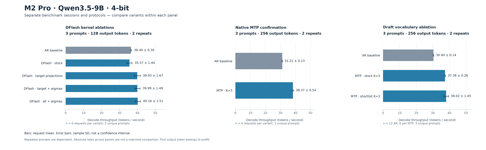

# Разгон Qwen3.5-9B-4bit на нашем M2 Pro

Дата: 22 сентября 2026. Apple M2 Pro, 19 GPU cores, 16 GB unified memory; macOS 15.6.1. Target — прежний `mlx-community/Qwen3.5-9B-4bit`, без смены квантовки. Это короткая серия разработки, **не завершённый benchmark 100 × 2048**.

[Обзор первоисточников и кандидатов](apple-m2-speed-candidates-2026-09-22.md) → [полные таблицы всех серий](results/speed-experiments-2026-09-22.md) → [машиночитаемый отчёт](results/speed-experiments-2026-09-22.json).

Всего сохранено **15 серий**: 14 завершённых и одна с ошибкой warmup. Это **206 записанных генераций**, включая reference/bracket, и **36,992 output token IDs**; все сравнения с AR совпали, сна внутри генераций не обнаружено. Из них 16 запросов содержат полные event traces. Это число повторных измерений, а не число независимых задач.

## Что уже получилось

В DFlash удалось удешевить проверку блока существующими small-M affine kernels из MLX-VLM и fused full-vocabulary argmax. В сбалансированной серии **3 задачи × 128 токенов × 2 повтора**:

| Режим | Decode, tok/s, среднее ± SD |
|---|---:|
| AR, исходный | 36.403 ± 0.304 |
| AR, affine во всех target projections | 34.880 ± 0.093 |
| DFlash K=3, исходный | 35.566 ± 1.436 |
| DFlash, affine target | 39.932 ± 1.670 |
| DFlash, affine target + fused argmax | 39.994 ± 1.492 |
| DFlash, affine target/draft + fused argmax | **40.161 ± 1.512** |

Последний вариант быстрее исходного DFlash примерно на **12.9% по отношению средних скоростей** и соседнего AR на **10.35% по среднему парному отношению**. Во всех 40 запросах этой серии, включая references/bracket, IDs полностью совпали с AR. Оптимизированный AR также проверен: эти kernels полезны именно для короткого блока верификации, а однотокенный путь они не ускорили. Дополнительный argmax даёт намного меньше, чем перенос projections target; небольшой разрыв между последними тремя вариантами не позволяет объявить один универсальным победителем.

Отдельная проверка обычного MTP K=3: **3 задачи × 256 токенов × 2 повтора**, AR **31.209 ± 0.134**, MTP **38.373 ± 0.544 tok/s**, среднее парное отношение **1.2296 ± 0.0222**. Все IDs совпали. Условия этой серии отличаются от DFlash: сравнивать их абсолютные tok/s между строками разных серий нельзя.



## Словарь только для MTP-головы

Вариант на **32,988 IDs из 248,320** уменьшает выходной readout draft. В нём фиксированный диапазон IDs 0–32767, union токенов из output калибровочных строк 100–109 и tokenizer specials. Packed 4-bit rows/scales/biases собираются без переквантования. Полная target-голова остаётся в памяти и используется для каждой проверки и коррекции; итоговый словарь модели не сужается. Входной prompt и тестовые output IDs при построении не добавлялись. Размер 32k выбран после просмотра недостаточного покрытия малого словаря, поэтому это **development tuning**.

Короткий scout на первой задаче × 128 × 2 показал 47.67 tok/s против 43.75 у stock MTP. На расширенной серии случился AR drift −20.2%; она сохранена как диагностическая. Повтор **3 задачи × 256 × 2**, в более стабильных условиях:

| Режим | Decode, tok/s, среднее ± SD | Среднее парное отношение к своему AR |
|---|---:|---:|
| AR, 12 контролей | 30.401 ± 0.136 | 1.000 |
| Stock MTP K=3, 6 запросов | 37.363 ± 0.262 | 1.2295 ± 0.0097 |
| MTP K=3, draft shortlist, 6 запросов | 38.025 ± 1.451 | 1.2504 ± 0.0487 |

**Прямое shortlist/stock отношение: 1.0178 ± 0.0397; медиана 1.0062.** Средний прирост +1.78% во многом определяется одним удачным запросом (+9.57%); остальные пять пар лежат между −1.05% и +1.74%. Этого недостаточно, чтобы объявить устойчивое преимущество над обычным MTP. Все 26 запросов этого повтора полностью совпали с AR по token IDs; в каждом MTP режиме 6 × 256 = 1,536 проверенных output IDs на 3 уникальных задачах. AR drift начала/конца −3.17% тоже сохраняется в отчёте.

Acceptance: stock 90.48%, shortlist 91.00%, средние по запросам. Ограничение только draft может как ухудшать предложения, так и иногда заменять ошибочный редкий draft-token на правильный доступный; target остаётся окончательным проверяющим. Детальные затраты readout отдельно не профилировались, поэтому их абсолютную экономию из общей скорости не выводим.

**Рабочая рекомендация этой серии — stock MTP K=3.** Shortlist остаётся opt-in исследовательским режимом. Ни результаты 47.7 tok/s на одном коротком примере, ни +25.0% относительно AR в повторе не означают такой прирост относительно уже работающего MTP.

## Что попробовали и что не помогло

| Идея | Локальный результат | Интерпретация |
|---|---|---|
| ZMLX fused DeltaNet / SwiGLU / вместе | 1 задача, 64 токена, 2 повтора: AR 36.716; варианты 36.784 / 36.694 / 36.588 tok/s | Практически нейтрально; авторские +7.5% на M4 Max у нас не воспроизвелись |
| MTP K=2/3/4/5 | На 1 задаче × 128: 38.99 / 43.52 / 10.90 / 7.43 tok/s при AR около 36.2 | K=3 — полезная точка; больше accepted tokens за раунд не означает больше tok/s |
| Перенос streamed affine dispatch с T≥6 на T≥3 | K=3/4/5: 24.83 / 23.41 / 22.05 tok/s | Уменьшает провал K≥4, но не обгоняет AR |
| Двухтокенный tiled dispatch с T≥2 | K=2/3/4/5: 31.69 / 18.16 / 17.54 / 16.51 при AR около 30.45 | Также не выигрыш относительно лучшего stock MTP |
| CPU n-gram, 1/2/4 proposals, minimum suffix 2/4 | Короткий scout не дал надёжного выигрыша; повтор с событиями также не дал устойчивого преимущества | AR bracket drift +6.4% и −20.9%; обе серии помечены diagnostic-only, точный процент эффекта не заявляем |
| Удалить лишний target forward между MTP rounds | Аудит существующего кода | Наша реализация уже использует verifier hidden states; лишнего полного forward, описанного в чужом runtime, здесь нет |
| Draft vocabulary из 10 калибровочных ответов: 1,382 IDs | Stock MTP 43.93 → shortlist 37.99 tok/s на 1 × 128 × 2; acceptance 90.1% → 64.3% | Из 128 токенов контрольного ответа 16 отсутствуют в словаре; уменьшение readout не компенсировало падение acceptance |

Первый ZMLX запуск прервался на warmup из-за ошибки восстановления `nn.Module` в нашем адаптере. Ошибка исправлена до повторного измерения; запись ошибки сохранена, в таблицу скорости она не входит. `nn.Module.update` предназначен для параметров, поэтому восстановление словаря Module выполняется через `dict.update`.

Провал ширины K≥4 согласуется с плохим масштабированием small-M quantized kernels. Версия о register pressure остаётся гипотезой: hardware counters/spill не измерялись. Из этих данных нельзя делать вывод, что сам MTP стал хуже предсказывать: в scout K=4/5 полезных токенов за раунд больше, но цена раунда резко выросла.

## Как измеряли

- Один запрос, greedy, одинаковые tokenized prompts, фиксированный бюджет; EOS игнорируется. Первый токен включён в prefill, остальные N−1 — в decode.
- Fresh request caches, warmup перед измерениями, `mx.eval`/synchronization конечных cache states. Прочтение JSON, текстовый decode, построение словаря и компиляция прогрева не включены в decode.
- MTP/shortlist: одна resident target/draft модель, соседние парные AR, порядок меняется между повторами. При сравнении shortlist с stock MTP даже массивы shortlist остаются в памяти в обоих режимах.
- DFlash: одинаковые resident weights, измерения вариантов в прямом/обратном порядке. AR на том же prompt/repeat служит контролем. Это не отдельная соседняя AR пара на каждое ядро.
- Output token IDs сохранены полностью и сравниваются с AR. Это эмпирическое равенство на измеренных входах, не доказательство exactness для любых промптов/near-ties.
- Mean ± sample SD — разброс запросов, не confidence interval и не независимые задачи: 3 prompts × 2 repeats дают 6 измерений, но лишь 3 уникальных задачи.
- Логи сохраняют питание, thermal snapshots, sleep evidence, версии и hashes исходников. Mac оставался awake. Скорость AR в разных сериях менялась примерно между 29 и 37 tok/s; встречались AC с разрядом батареи и Battery Power. Поэтому общий рейтинг по абсолютным tok/s разных серий не строится.
- Порог 5% изменения начального/конечного AR используется как диагностическая эвристика отчёта, а не статистический тест или заранее зарегистрированный критерий. Отсутствие drift не гарантирует отсутствия внутрисерийных помех.
- Event-traced запуски вынесены отдельно: чтение proposal IDs на CPU влияет на scheduling, и эта цена включена в их timings. Не смешиваем их с обычными замерами скорости.

## Воспроизведение

Каждому запуску соответствует `.sh` и одноимённый `.py`. Existing environments/weights подготавливаются по README. ZMLX source checkout pinned, установленные пакеты не модифицируются:

```bash
bash scripts/setup/speed_candidates.sh

bash scripts/benchmark/kernel_sweep.sh \
  --variants ar zmlx-deltanet zmlx-swiglu zmlx-both \
  --prompt-count 1 --tokens 64 --repeats 2

bash scripts/benchmark/kernel_sweep.sh \
  --variants ar ar-target dflash dflash-target dflash-target-argmax dflash-all-argmax \
  --prompt-count 3 --tokens 128 --repeats 2 --block-size 3

bash scripts/benchmark/mtp_sweep.sh \
  --block-sizes 3 --prompt-count 3 --tokens 256 --repeats 2

# Alternative dispatches, experimental and slower in this series:
bash scripts/benchmark/mtp_sweep.sh --streamed-from 3 --block-sizes 3 4 5 --prompt-count 1 --tokens 128 --repeats 1
bash scripts/benchmark/mtp_sweep.sh --tiled-from 2 --block-sizes 2 3 4 5 --prompt-count 1 --tokens 128 --repeats 1

# Draft from the already committed text, with no additional neural model:
bash scripts/benchmark/ngram_sweep.sh --widths 1 2 --min-matches 2 --prompt-count 1 --tokens 256 --repeats 2 --trace
```

Для отдельного сравнения draft-словаря:

```bash
bash scripts/analysis/draft_vocab.sh --prefix-tokens 32768 \
  --output configs/optimizations/mtp-draft-vocab-32k.json

bash scripts/benchmark/mtp_sweep.sh \
  --draft-vocab configs/optimizations/mtp-draft-vocab-32k.json \
  --compare-stock-draft --block-sizes 3 \
  --prompt-count 3 --tokens 256 --repeats 2
```

Сравниваем полезные committed tokens; прогрев, draft overhead, отказы и rollback не вычитаются из реального decode. Не запускайте GPU sweep параллельно с другой моделью; экспериментальные sweep используют общий файловый lock, но сторонний процесс он не остановит.

## События и offline replay

Отдельная запись на 512 токенов сохраняет AR, stock MTP и shortlist MTP, с фактическими предложениями, отказами и моментами commit. Полный 512-token output совпал. В этой серии начальный/конечный AR изменился на **+16.9%**, поэтому она годится для просмотра траектории, но **не используется как подтверждение ускорения**. Все timings включают event instrumentation.

Можно восстановить визуализацию из опубликованного gzip, не запуская модель:

```bash
bash scripts/demo/from_sweep.sh \
  --input docs/results/speed-experiments-2026-09-22/20260922-mtp-vocab32k-trace512/raw.json.gz \
  --prompt-index 0 --repeat 0 --block-size 3 \
  --output artifacts/demos/mtp-vocab32k-512/trace.json

bash scripts/demo/render.sh \
  --trace artifacts/demos/mtp-vocab32k-512/trace.json \
  --output artifacts/demos/mtp-vocab32k-512
```

`from_sweep` выбирает treatment `mtp` и **его соседний AR по pair_id**, а не самый медленный baseline. Он проверяет полные IDs, trace chronology/counters, hashes prompts/tokenizer/vocabulary и не восстанавливает события из средних скоростей. Визуальная подпись показывает реальный размер draft-словаря. `--prompt-index` — позиция в сохранённом `protocol.prompts`, не произвольный source row датасета. Новую запись можно получить через `mtp_sweep.sh ... --trace`; запуски без этого флага сохраняют output IDs и времена фаз, но не индивидуальные timestamps токенов.

## Артефакты и проверки

[Опубликованные логи](results/speed-experiments-2026-09-22/) содержат для каждой серии `summary.json` и `raw.json.gz`. [Publication manifest](results/speed-experiments-2026-09-22/publication-manifest.json) связывает hashes исходных и очищенных файлов. Убраны абсолютные префиксы путей репозитория/home; измерения, текст, token IDs и event traces не изменены. Ошибка первого ZMLX warmup сохранена вместе с остальными результатами.

Отчёт и график можно пересобрать из опубликованных файлов:

```bash
bash scripts/analysis/speed_experiments_report.sh \
  --inputs docs/results/speed-experiments-2026-09-22/20260922-* \
  --output artifacts/reports/speed-experiments

bash scripts/analysis/speed_experiments_plot.sh \
  --dflash docs/results/speed-experiments-2026-09-22/20260922-affine-confirm \
  --mtp docs/results/speed-experiments-2026-09-22/20260922-mtp-k3-confirm \
  --vocab docs/results/speed-experiments-2026-09-22/20260922-mtp-vocab32k-recheck \
  --output artifacts/reports/speed-experiments.png
```

Полный набор тестов основного окружения: **905 passed, 28 subtests passed**. Отдельно проверены hashes всех опубликованных raw, 206/206 parity/awake flags, offline replay реального gzip и визуальный preview. Проверка source/restore/dispatch контрактов не заменяет GPU-измерения; обе категории выполнены. Все изменения экспериментальных kernels scoped и восстанавливаются после выхода; установленные пакеты и target weights не редактировались.

## Что ещё не проверено

EAGLE3 checkpoint для этой модели, native gmlx, mlxcel, новые quantization presets, TreeWY и полноценные learned/adaptive draft policies остаются кандидатами. Их код/статьи и ограничения собраны в [обзоре](apple-m2-speed-candidates-2026-09-22.md). Другой quant checkpoint потребует отдельного сравнения качества. Заявлять абсолютный предел скорости Mac по этим коротким сериям нельзя.
