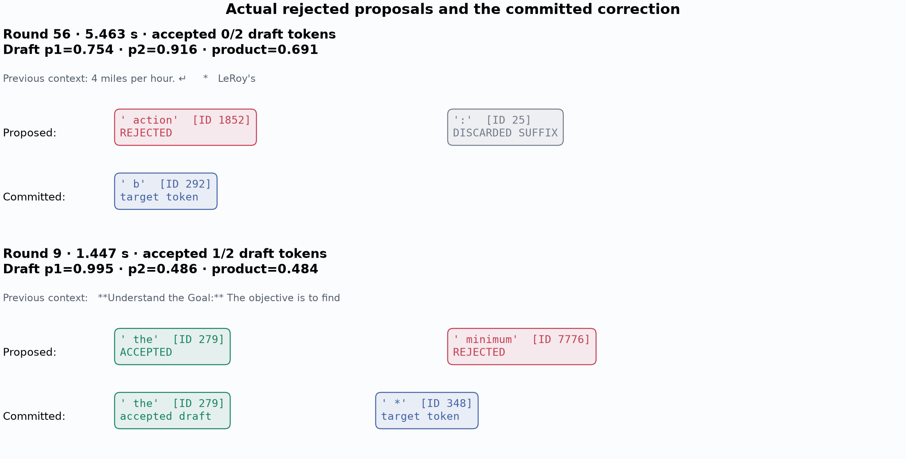
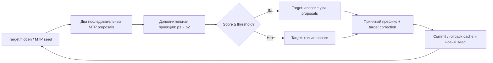
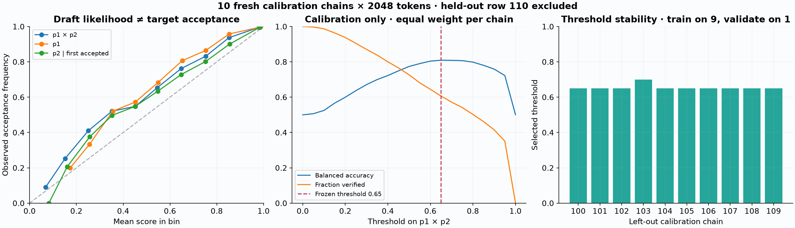

# MTP confidence gate: 10 calibration chains + 1 held-out trajectory

Этот эксперимент проверяет конкретную гипотезу: помогает ли произведение вероятностей двух MTP proposals выбрать, когда стоит проверять оба токена, а когда — сделать один target-шаг. Уверенность драфтера и совпадение с target — разные величины; хорошая классификация acceptance ещё не означает ускорение.

## Завершённый held-out прогон: 2048 токенов

**Stock MTP ускорил decode этой траектории на 8,75%; gate 0,65 замедлил на 16,77% относительно первого AR.** Во всех пяти режимах получены **те же 2048 token ID**. EOS не встретился в пределах бюджета: график не содержит продолжения после EOS; сам бюджет мог прервать рассуждение. Это одна проверочная задача, а не оценка средней скорости на новых десяти prompts или на исходных ста.

Строка 110 — задача о лодке в миле от берега, поступлении 10 галлонов воды в минуту, допустимых 30 галлонах и движении к берегу со скоростью 4 мили/час. Нужно найти минимальную скорость откачки. Выбор строки не менялся после калибровки.

| Режим | Prefill, s | Decode, tok/s | Prefill + decode, s | Δ decode к AR до |
|---|---:|---:|---:|---:|
| AR до | 0.633 | 29.83 | 69.264 | +0.00% |
| Stock MTP | 0.659 | 32.44 | 63.769 | +8.75% |
| MTP + probabilities | 0.669 | 30.11 | 68.662 | +0.94% |
| MTP + gate 0,65 | 0.674 | 24.83 | 83.130 | -16.77% |
| AR после | 0.658 | 29.29 | 70.537 | -1.79% |

Stock MTP выдал последний токен на **5,501 s раньше** первого AR по наблюдаемым commit-событиям. Повторный AR оказался на 1,79% медленнее первого; диапазон baseline — 29,29–29,83 tok/s. Все принятые held-out измерения выполнены при зарядке, процент батареи вырос с 27 до 40; sleep-guard пройден. Температура, частоты и прочая нагрузка ОС не фиксировались аппаратно. SD между повторениями одного режима здесь оценить нельзя: выполнено по одному запросу каждого режима.


На **общем окне 0,674–63,762 s** (после всех prefill, до первого завершения):

| Режим | Средний lead, tokens | SD lead, tokens | Min…max lead | SD изменения lead / 100 ms |
|---|---:|---:|---:|---:|
| Stock MTP | +85.06 | 48.97 | -3…170 | 1.429 |
| MTP + probabilities | +1.16 | 10.57 | -21…26 | 1.228 |
| MTP + gate 0,65 | -140.24 | 95.76 | -313…1 | 1.188 |
| AR после | -21.68 | 9.52 | -34…0 | 0.409 |

Gate уменьшил последний показатель с 1,429 до 1,188 относительно stock MTP, но одновременно сильно замедлил выдачу. Плавность сама по себе не является выигрышем. При полном совпадении ID нижний график сравнивает время получения **того же самого токена**, а не просто похожую длину текста.

### Почему высокий acceptance не дал скорости

| Работа на held-out цепочке | Stock MTP | MTP + probabilities | MTP + gate |
|---|---:|---:|---:|
| Target decode rounds | 788 | 788 | 1149 |
| Построенные и учтённые draft proposals | 1576 | 1576 | 2297 |
| Proposals, реально проверенные target | 1576 | 1576 | 922 |
| Принятые draft tokens | 1259 | 1259 | 898 |
| Acceptance среди проверенных draft tokens | 79,89% | 79,89% | 97,40% |
| Anchor-only fallback rounds | 0 | 0 | 688 |

Сбор probabilities/проектный цикл добавил **4,883 s decode** против stock MTP. Gate построил ещё больше proposals, **1375** из них отбросил до проверки и увеличил число target-раундов с 788 до 1149. Acceptance вырос до 97,40%, но полезных draft-токенов стало меньше. Throughput gate ниже stock MTP на **23,46%**. Накопленные затраты на draft, confidence и обслуживание cache не возвращаются при выборе anchor-only шага.

На отдельном always-verify held-out логе замороженный классификатор сохранил precision **95,71%**, balanced accuracy **79,96%**, coverage **50,25%** и recall **67,44%**. Эти labels не переносятся на непроверенные proposals gated-прогона: у него уже другие границы раундов. Порог после просмотра held-out не подбирался заново.

Следующий обоснованный эксперимент — **дешёвое раннее решение до построения драфта**, с критерием ожидаемой экономии времени, а не только balanced accuracy. Текущий отрицательный результат не доказывает бесполезность любой adaptive speculation; он проверяет именно этот post-draft gate.

### Реальные примеры принятия и отказа



Это первые подходящие раунды always-verify held-out trace, с контекстом последних 12 токенов. В первом score 0,691 выше порога, но target отверг ` action`; это пример false positive. Во втором ` the` принят, ` minimum` отвергнут, а target продолжает форматирование токеном ` *`. Отдельный токен может быть лишь частью слова: ` b` на верхней карточке — точный выданный token, без замены на целое слово.

[Машиночитаемые результаты и provenance](results/mtp-confidence-2048.json) · [Статистика траекторий](results/mtp-confidence-trajectory.json) · [Примеры отказов](results/mtp-confidence-rejections.json).

## Данные и заранее заданный протокол

Используется тот же `Qwen3.5-9B-4bit` и отдельная native MTP-голова. Target revision: `8b2b98c00a6b4d291155e4890773ca8f769aee53`; draft revision: `222dfd2c23fc9518d7b817e4f8e0cb0571787489`. Apple M2 Pro, 16 GB; greedy, batch 1, свежий cache на каждый запрос. Блок MTP состоит из anchor и максимум двух последовательных proposals.

Из `ThunderstormXXL/deepscaler-teacher-sft-vllm-official-40k`, revision `6f0fadbf6b495cdea0e4bd83c4b64c7e36a992a3`, одним ограниченным запросом загружены 11 новых строк. **100–109** — calibration; **110** — единственная held-out задача. Проверена непересекаемость индексов и текстов задач с исходными 0–99 и между новыми частями. Сохранены исходные ответы teacher, но модель получает только задачу в официальном thinking chat template. Labels получаются из verifier нашей модели, а не из teacher forcing.

На каждой из десяти calibration-задач генерируются **2048 новых токенов** и записываются все предложения, нормированные вероятности, результаты проверки и реальные времена. EOS игнорируется ради одинакового бюджета; это фрагменты рассуждений, не обязательно законченные решения. Однотокенные хвосты бюджета не входят в калибровку пар.

Порог выбирается только по этим десяти цепочкам, из сетки `0, 0.05, …, 1`. Positive label — оба proposal приняты; prediction — `p1 × p2 >= threshold`. Цель — средняя по цепочкам balanced accuracy; при равенстве выбирается меньший порог. Это критерий классификации, **не оптимизация времени**. Leave-one-chain-out: десять раз выбираем порог на девяти цепочках и проверяем на оставшейся. Разбивать отдельные токены случайным образом нельзя: соседние раунды одной цепочки зависимы.

Затем policy и хэши её источников фиксируются. На строке 110 выполняются пять режимов в заранее заданном порядке:

1. Обычный autoregressive MLX-VLM, `ar_before`.
2. Stock native MTP, `stock_mtp`.
3. MTP с дополнительным измерением вероятностей, без gate, `confidence_collect`.
4. MTP с зафиксированным confidence gate, `confidence_gate`.
5. Повтор обычного autoregressive, `ar_after`, для видимого контроля дрейфа условий.

Stock MTP также использует fused quantized argmax; обычный MLX-VLM AR идёт своим native full-logits путём. Сравнение оценивает весь runtime, а не изолированный эффект уменьшения числа target-проходов.

Перед каждым режимом — отдельный немеряемый warmup на 2048 токенах. Prefill, decode и полное время разделены. Сравниваются все 2048 output token ID, а не только текст. Один held-out prompt позволяет проверить конкретную траекторию, но не оценить средний speedup по датасету.

## Где взяты вероятности и что реально делает gate

Native fused argmax оставлен источником proposal IDs. Из соответствующих нормированных hidden states дополнительной проекцией в полный словарь вычисляется `log p = selected_logit − logsumexp(logits)` в float32. На CPU читаются только один-два выбранных log-probability. Для первой позиции используется seed hidden, созданный предыдущим accept/prefill; для второй — следующий hidden MTP. Такое смещение важно: брать просто первые два вызова головы было бы неверно.

`p1 × p2` — вероятность этой последовательности **по драфтеру**, а не вероятность того, что target примет пару. В первом варианте gate проверяется **после построения обоих proposals**. Их стоимость уже оплачена. Если score ниже порога, target проверяет только anchor, выдаёт свой следующий greedy-токен, а cache и seed головы согласованно обновляются. Это сохраняет greedy-контракт, но данный путь всё ещё оплачивает обслуживание MTP cache и не равен по цене обычному AR backend.



Поэтому отдельные контроли нужны для двух разных эффектов: `collect` против `stock_mtp` показывает цену наблюдения confidence; `gate` против `collect` — изменение полного исполнения после включения порога. Версия `collect` использует проектный цикл раундов поверх того же native verifier; разница со stock включает и этот цикл/логирование, а не только дополнительный softmax. Gate меняет границы раундов и дальнейшие proposals. По исходному логу нельзя честно «вычесть неудачные раунды» и получить контрфактический speedup.

Следующий вариант при отрицательном результате — дешёвый predictor **до** построения второго/обоих proposals: например, признаки предыдущих раундов, margin top-1/top-2 или специальная маленькая acceptance-head. Его стоимость, обучение и проверка на новых цепочках станут отдельным экспериментом. На temperature > 0 текущий gate не переносится автоматически: требуется корректный stochastic speculative sampler и причинная политика выбора длины; подробнее в [обзоре](inference-acceleration-survey-2026.md).

## Результат калибровки

Завершены все **10 × 2048 = 20 480** generated tokens. Получено **7621** полных проверенных пар. Выбран порог **0,65**; policy зафиксирована до первой held-out генерации.

| Calibration metric | Значение |
|---|---:|
| Оба proposal приняты без отбора | 77,89% |
| Доля пар, прошедших порог | 60,52% |
| Оба приняты среди прошедших порог — precision | 95,62% |
| Recall удачных пар | 74,29% |
| Macro balanced accuracy по 10 цепочкам | 80,93% ± 1,55 п.п. SD |
| LOCO balanced accuracy на исключённой цепочке | 80,78% ± 1,60 п.п. SD |

В девяти LOCO folds выбран threshold 0,65, в одном — 0,70. Из 5936 удачных пар **1526** не прошли бы порог: высокая precision достигается в том числе отказом от полезных proposals. Именно поэтому результат классификации нельзя выдавать за доказательство ускорения. LOCO здесь описывает устойчивость выбора внутри десяти calibration-цепочек; held-out строка 110 в этих числах не участвует.



[Скачать плоский набор пар](results/mtp-confidence-rounds.jsonl.gz) — gzip JSONL, без весов модели. SHA-256 распакованного JSONL: `2531a8b9d165ed520a0048058e050f50cda0d717ca272cb27709085293aac9db`. Вероятности и labels относятся к native MTP указанного checkpoint на сгенерированных им продолжениях; это не универсальная модель acceptance.

## Отказы из-за записи чисел словами или цифрами

Такие расхождения возможны: `four` и `4` могут выражать одно число, но имеют разные token IDs. Verifier обязан отклонить несовпавший proposal, если сохраняется исходный greedy-output target. Замена «по смыслу» меняет генерацию и её дальнейший контекст.

В этой calibration-выборке простая эвристика **не обнаружила таких случаев среди 1685 отклонённых пар**. Она проверяет первое несовпадение, сопоставляет начало оставшихся proposals с настоящим продолжением target, учитывает отдельный пробел перед цифрой и распознаёт ограниченный словарь английских количественных числительных. Это не доказательство отсутствия категории вообще: порядковые/составные числительные, другая пунктуация и языки могут быть пропущены; ранее замеченный отдельный пример может относиться к другой траектории. [Результат и ограничения проверки](results/mtp-confidence-number-forms.json).

Если на другом домене эта категория частая, можно учить drafter или дешёвый acceptance-predictor на соответствующих отказах. Но менять формат только у target ради acceptance нельзя без отдельной оценки качества и нового baseline. Даже совпадение численного значения первых токенов не доказывает равенства полного числа: `2` может быть началом `20`.

```bash
bash scripts/report/number_forms.sh \
  --policy artifacts/experiments/mtp-confidence/policy2048/policy.json \
  --output artifacts/analysis/mtp-confidence-number-forms.json
```

## Что сохраняется и как повторить

Каждый запуск имеет пару `.sh`/`.py`; реализация разбита на downloader, backend, experiment runner, calibrator и offline report. Локальные артефакты не коммитятся; отчёт публикует компактные результаты и хэши.

```bash
# Только 11 дополнительных строк, не весь parquet/dataset
bash scripts/download/validation.sh

# Отдельная CPU-среда для Matplotlib; MLX environment не меняется
bash scripts/setup/analysis.sh

# Быстрая проверка extreme gates и greedy parity
bash scripts/benchmark/mtp_confidence.sh smoke \
  --max-new-tokens 64 --warmup-tokens 64 \
  --output artifacts/experiments/mtp-confidence/smoke64

# Сбор на calibration 100–109; один немеряемый warmup + 10 запросов
bash scripts/benchmark/mtp_confidence.sh collect \
  --output artifacts/experiments/mtp-confidence/calibration2048

# Offline: выбор порога и неизменяемая policy, без inference
bash scripts/report/mtp_confidence_calibrate.sh \
  --samples artifacts/experiments/mtp-confidence/calibration2048/samples.jsonl \
  --output artifacts/experiments/mtp-confidence/policy2048

# Только после freeze: 1 held-out prompt × 5 режимов
bash scripts/benchmark/mtp_confidence.sh evaluate \
  --policy-path artifacts/experiments/mtp-confidence/policy2048/policy.json \
  --output artifacts/experiments/mtp-confidence/heldout2048

# Offline: текстовые токены, графики, пары rejected/accepted, replay JSON
bash scripts/report/mtp_confidence.sh \
  --run artifacts/experiments/mtp-confidence/heldout2048 \
  --policy artifacts/experiments/mtp-confidence/policy2048/policy.json \
  --output artifacts/analysis/mtp-confidence2048
```

Сохранённый pair trace можно превратить в ту же анимацию независимо от benchmark:

```bash
bash scripts/demo/render.sh \
  --trace artifacts/analysis/mtp-confidence2048/confidence_gate-replay.json \
  --output artifacts/demos/confidence-heldout110 --rates 1 --fps 25
```

Для сравнения со stock MTP выберите `stock_mtp-replay.json`. Renderer использует исходные timestamps; частота кадров влияет только на точность показа, не на вычисленные скорости. Если ID разошлись, воспроизведение требует явного `--allow-mismatch` и показывает расхождение.

По умолчанию runner требует питание без разряда. Для этого конечного эксперимента явно использован `--allow-battery` во всех GPU-командах: питание и процент записаны, при падении ниже 20% работа останавливается. На каждом warmup/request проверяются непрерывные и awake-часы Mac; сон более секунды делает измерение недействительным. Не следует запускать второй GPU benchmark параллельно. `--resume` допускает только неизменные данные, policy, код и runtime; завершённые строки проверяются и повторно не измеряются.

В frozen policy bundle сохраняется также `rounds.jsonl`: отдельная строка на каждую полностью проверенную пару, предыдущие 12 generated token IDs, proposal IDs, `p1`, `p2`, product и labels. `second_accepted_given_first=null`, если первый proposal отклонён: в таком случае второго независимого label нет. SHA-256 и число строк закреплены в policy и calibration report. Это готовые признаки/labels для будущего predictor, но разбиение при обучении по-прежнему должно идти по целым цепочкам.

Первая попытка held-out остановилась **на warmup**, до первого принятого измерения: Mach clocks зафиксировали 1327,18 s сна. Недействительный warmup сохранён отдельно; при возобновлении повторяется полный прогрев. Calibration, выбранный threshold и production-код не менялись. Этот эпизод не включён ни в timings, ни в число успешных observations.

В `samples.jsonl` есть полная генерация и `generation_trace`: реальные моменты draft/commit, token IDs, принятый префикс и коррекция target. В `confidence_rounds` — `p1`, `p2`, log-probabilities, произведение, decision, acceptance и host-времена фаз раунда. Отброшенные gate предложения имеют `accepted_count=null`: их target не проверял, поэтому они не называются rejected. Текстовое обогащение и графики строятся после измерения, без повторной генерации. Host-подфазы с lazy GPU execution не являются изолированными временами kernels.

## Как читать графики

`N(t)` — число уже выданных токенов, в общей шкале секунд от начала запроса, включая prefill. `Δ(t) = N_method(t) − N_AR(t)` может быть отрицательным. Для полностью совпавшей последовательности дополнительно показывается `T_AR(n) − T_method(n)`: насколько раньше получен тот же n-й токен.

Среднее и SD lead взвешены по реальному времени между событиями. Окно начинается после обоих prefill и заканчивается, когда первая сторона закончила: искусственный хвост «догоняния» не попадает в SD. SD самого lead включает накопление отрыва из-за разницы средних скоростей. Для неравномерности выдачи отдельно используется SD изменений lead на фиксированной сетке 100 ms; его нельзя оптимизировать отдельно от throughput, поскольку более медленная выдача тоже может выглядеть плавнее. Это описания темпа одной траектории, **не** доверительные интервалы. Окна разных пар могут отличаться; для сравнения методов в отчёте дополнительно приводится общее окно.

Красный proposal — первое несовпадение с target; серый следующий proposal — отброшенный суффикс с уже неверным контекстом. Серый нельзя объявлять независимо ошибочным. Зелёные токены реально приняты, синие добавлены target. Рисуются первые подходящие раунды с 0/2 и 1/2 accepted, без отбора красивого результата.
